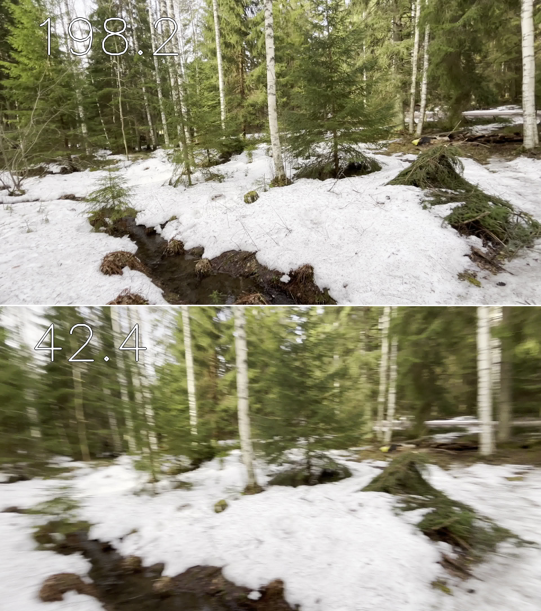

# Blur Detection
This repository implements blur detection based on variance of the Laplacian.



## Install
```
pip3 install -r requirements.txt
```
## Usage

To compute blur values for a set of images stored in a directory:

```
python3 blur_detector.py --images <path to directory with images>
```

To downsample a set of video frames (sorted in a sequential order in the directory):
```
python3 blur_detector.py --images <path to folder with images> --downsample
```

If you have previously computed the blur values, you can use them:
```
python3 blur_detector.py --images <path to folder with images> --downsample --precomputed
```
